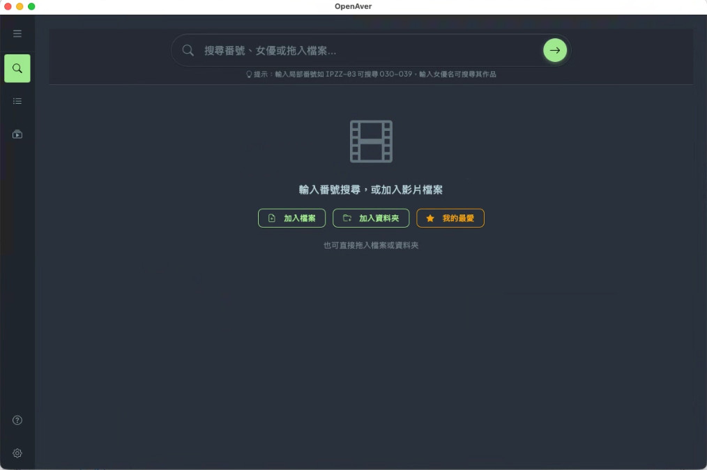
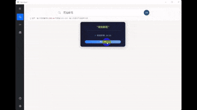
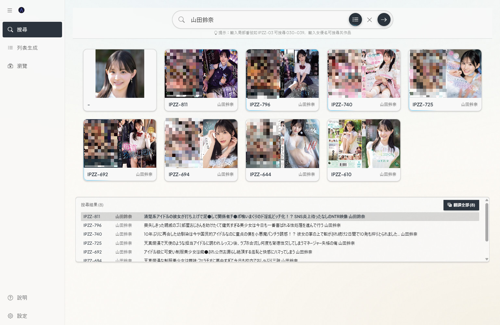
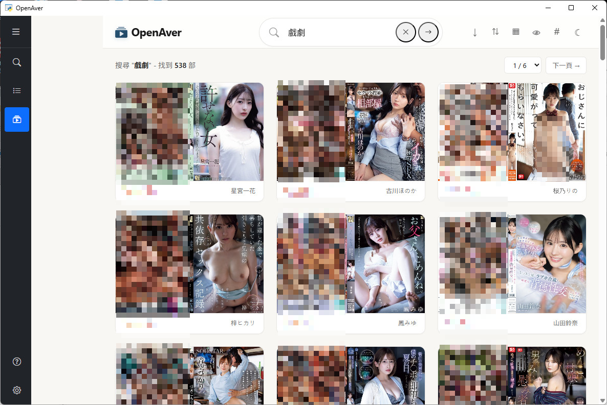

<p align="center">
  
</p>

<h1 align="center">OpenAver</h1>

<p align="center">
  <strong>現代化的 JAV 影片元數據管理工具 (Modern JAV Metadata Manager)</strong>
</p>

OpenAver 是一個基於 Web 技術的桌面應用程式，旨在幫助您輕鬆管理、刮削和生成 JAV 影片的元數據與展示列表。


## 📸 截圖預覽



<details>
<summary>更多截圖</summary>



| 搜尋結果 | Showcase Grid | Showcase 詳細 |
|----------|---------------|---------------|
|  |  |  |

</details>

## ⚠️ 免責聲明

本專案僅供個人學習研究使用，請使用者遵守：
- 尊重網站服務條款
- 合理控制請求頻率
- 不用於商業目的

使用本專案造成的任何後果由使用者自行承擔。

## 🔒 隱私聲明

OpenAver 是純本地應用程式：
- ✅ 不蒐集使用者資料
- ✅ 不上傳檔案資訊到遠端伺服器
- ✅ 所有操作在您的電腦本地執行
- ⚠️ 網路請求僅用於刮削公開影片元數據

---

## ✨ 核心功能

### 🔍 Spotlight Search (搜尋)
- **多來源聚合**: 同時搜尋 JavBus, Jav321, JavDB 等多個來源。
- **Gallery Style**: 現代化的 Hero Detail 介面，以大圖和毛玻璃特效呈現影片資訊。
- **智慧搜尋**: 支援番號自動標準化、前綴搜尋、女優搜尋。
- **女優畫廊模式 (Beta)**: 女優搜尋結果 > 10 片時自動切換為 Gallery 瀏覽，顯示女優個人資料 Hero Card。
- **本地檔案搜尋優化**:
  - 拖入檔案自動過濾（副檔名 + 大小）
  - 批次搜尋（20 個一批，並發 2 個）
  - 暫停/繼續功能
  - 我的最愛資料夾一鍵載入

### 📝 Gallery Generator (列表生成)
- **靜態 HTML**: 掃描本地影片資料夾，生成精美的靜態 HTML 索引檔。
- **Mini-Terminal**: 內嵌式終端機視窗，即時顯示掃描與處理進度。
- **NFO 補全**: 自動檢測並補全缺失的 NFO 檔案。

### ⚙️ Settings (設定)
- **Dark Mode**: 全站支援深色模式，並自動同步至生成的 Viewer。
- **翻譯服務**: 支援 Ollama（本地）和 Gemini（Google）兩種翻譯提供商。
- **路徑管理**: 靈活設定輸出路徑與檔案命名規則。
- **我的最愛資料夾**: 設定常用資料夾，一鍵載入並自動搜尋。
- **檔案過濾**: 設定最小影片尺寸 (MB)，自動排除過小檔案。

### 🌐 翻譯功能

OpenAver 支援兩種翻譯提供商：

| 提供商 | 特點 | 速度 |
|--------|------|------|
| **Ollama（本地）** | 免費、無 API 限制、需本地 GPU | ~0.5 秒/片 |
| **Gemini（Google）** | 雲端 API、免費額度 15 RPM | ~0.1 秒/片 |

**⚠️ Gemini API Key 安全提示**

- API Key 以明文存儲在 `web/config.json`
- **請勿將 config.json 分享給他人或上傳至公開位置**
- 如需撤銷：前往 [Google AI Studio](https://aistudio.google.com/apikey) 重新生成

## 🛠️ 技術架構

- **Backend**: FastAPI (Python)
- **Frontend**: Jinja2 + Bootstrap 5 + Custom CSS (Gallery Design System)
- **Desktop**: PyWebView (Windows/macOS)
- **Testing**: Pytest

## 📥 下載

從 [GitHub Releases](https://github.com/slive777/OpenAver/releases/latest) 下載最新版本：

| 平台 | 檔案 | 狀態 |
|------|------|------|
| **Windows x64** | `OpenAver-vX.X.X-Windows-x64.zip` | ✅ 穩定版 |
| **macOS arm64** | `OpenAver-vX.X.X-macOS-arm64-alpha.zip` | 🧪 Alpha |

### macOS 首次執行 (重要)

由於沒有 Apple 簽名，macOS 會阻擋首次執行：

1. 右鍵點擊 `OpenAver.command`
2. 選擇「**打開**」(Open)
3. 在彈出對話框中點擊「**打開**」

> ⚠️ macOS 版本為 Alpha 測試，僅支援 Apple Silicon (M1/M2/M3/M4)。
> 如遇問題請至 [GitHub Issues](https://github.com/slive777/OpenAver/issues) 回報。

---

## 🚀 快速開始（原始碼）

### 前置需求
- Python 3.10+ (原始碼執行)
- Chrome/Edge (用於 PyWebView)
- **Microsoft Edge WebView2 Runtime** (Windows 10/VM 必備)

### 安裝
```bash
# 1. Clone 專案
git clone https://github.com/slive777/OpenAver.git
cd OpenAver

# 2. 建立虛擬環境
python3 -m venv venv
source venv/bin/activate  # Windows: venv\Scripts\activate

# 3. 安裝依賴
pip install -r requirements.txt
```

### 啟動
```bash
# 開發模式 (Hot Reload)
uvicorn web.app:app --reload --host 0.0.0.0 --port 8000

# 桌面模式 (Windows)
python windows/launcher.py
```

## ❓ 疑難排解 (Troubleshooting)

### 1. 程式無法啟動 / 閃退 (Windows)
**原因**: Windows 安全機制 (Mark of the Web) 封鎖了從網路下載的執行檔或 DLL。
**解法**:
1. 對下載的 `OpenAver-Windows-x64.zip` 點擊 **右鍵** -> **內容**。
2. 在下方勾選 **「解除封鎖 (Unblock)」**，然後按確定。
3. 重新解壓縮並執行 `OpenAver.bat`。
*或者使用 7-Zip 軟體進行解壓縮，通常可避開此問題。*

### 2. 介面顯示異常 / 空白 / 沒有毛玻璃特效
**原因**: 缺少 WebView2 Runtime 或 GPU 加速支援不足（常見於 Windows 10 或虛擬機）。
**解法**:
請下載並安裝 [Microsoft Edge WebView2 Runtime](https://go.microsoft.com/fwlink/p/?LinkId=2124703)。

### 3. macOS 無法開啟 / 安全性警告
**原因**: macOS Gatekeeper 阻擋未簽名的應用程式。
**解法**:
1. 右鍵點擊 `OpenAver.command` → 選擇「打開」
2. 在彈出的對話框中再次點擊「打開」
3. 只需設定一次，之後可正常雙擊執行

## 💬 社群

加入 [Telegram 群組](https://t.me/+J-U2l96gv0FjZTBl) 與其他使用者交流討論！

---

## 🐛 回報問題

如果您遇到問題或發現 Bug，請協助回報：

### 回報方式
1. 前往 [GitHub Issues](https://github.com/slive777/OpenAver/issues)
2. 點擊「New Issue」建立新問題
3. 請提供以下資訊：
   - 問題描述（發生什麼錯誤？）
   - 重現步驟（如何觸發這個問題？）
   - 您的環境（Windows 版本、是否使用打包版）
   - **日誌檔案**（如果有）

### 取得日誌檔案（Windows 打包版）
1. 執行 `OpenAver_Debug.bat`
2. 重現問題
3. 日誌位置：`%USERPROFILE%\OpenAver\logs\debug.log`
4. 將日誌檔案附加到 Issue

---

## 🧪 執行測試

本專案包含 API 整合測試與核心邏輯單元測試。

```bash
source venv/bin/activate
pytest
```

## 📂 目錄結構

```
OpenAver/
├── web/                # Web GUI (FastAPI)
│   ├── routers/        # API Endpoints (Search, Config, Scraper, AVList)
│   ├── templates/      # HTML Templates (Gallery Style)
│   └── static/         # CSS/JS Assets (Modular JS, Theme CSS)
├── core/               # 核心邏輯
│   ├── scraper.py              # 刮削器 (JavBus/Jav321/JavDB)
│   ├── actress_scraper.py      # 女優爬蟲
│   ├── search_gallery_service.py # Gallery Service
│   ├── gallery_generator.py    # Gallery HTML 生成器
│   ├── organizer.py            # 檔案整理
│   └── path_utils.py           # 跨平台路徑處理
├── tests/              # 測試代碼 (Pytest)
└── windows/            # Windows 啟動器 (PyWebView)
```

## 打包 Windows 應用程式

```bash
# 確保在 venv 環境下執行
source venv/bin/activate
python build.py
```

## 🙏 致謝 (Acknowledgements)

OpenAver 使用並感謝以下開源專案：

- **[jvav](https://github.com/akynazh/jvav)** - JAV 元數據刮削工具庫，提供 JavBus/JavDB/JavLib 等多來源支援
- **[FastAPI](https://fastapi.tiangolo.com/)** - 現代化的 Python Web 框架
- **[PyWebView](https://pywebview.flowrl.com/)** - 輕量級的跨平台桌面應用框架
- **[Bootstrap](https://getbootstrap.com/)** - 前端 UI 框架

特別感謝所有為這些專案做出貢獻的開發者們。

## License

MIT License
