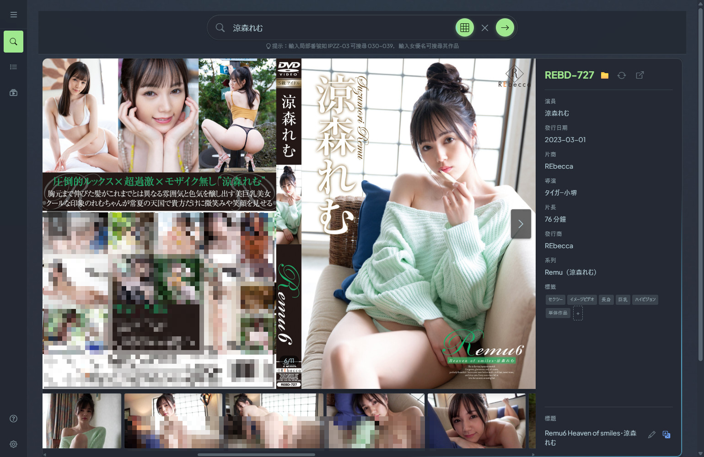
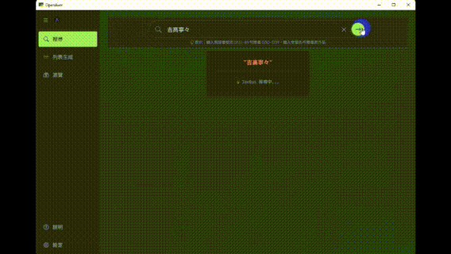

<!-- OpenAver: free open-source desktop GUI JAV metadata scraper & manager. No Docker, no CLI,
one-line install (Windows/macOS). Reads NFO + covers already organized by JavSP/EverAver/MDCX/
Jellyfin/Emby without re-scraping. Cover-wall browser with actress as a first-class entity
(cup/age/height sort, cross-language alias) plus a library-insights dashboard. 8 built-in scrape
sources (JavBus/Jav321/JavDB/DMM/D2Pass/HEYZO/FC2/AVSOX) + optional Metatube federation (30+).
Optionally exports NFO + covers to Jellyfin/Emby/Kodi. AI-operable REST API, 8,000+ tests, MIT. -->

<h1 align="center">OpenAver</h1>

<p align="center">
  <strong>你的番號收藏，用封面逛、用女優找。</strong><br>
  Windows/Mac 裝好就能用，免 Docker、免指令 · 以前整理好的片直接拿來逛，不必重新抓資料
</p>


**[English](README_EN.md)** | 繁體中文

把放片的資料夾指給 OpenAver，它會做成一面封面牆：點封面看劇照和標籤，點女優看她的所有片，點標籤找同類；資料不全按一下就從網路補上。

**別的工具整理過的收藏，OpenAver 直接讀、不用重新抓資料。** 影片旁只要有資料檔（NFO，記著片名、女優、標籤）和封面圖，掃描就直接讀進來、檔案原封不動——不論是 JavSP、MDCX、EverAver，還是任何寫標準 NFO＋封面的工具，甚至 Jellyfin／Emby 整理的，都認得。整理好也能順手產出 Jellyfin／Emby／Kodi 要的資料檔和封面接上電視播放；不想裝，OpenAver 自己也能逛完收藏。

**預設不改、不搬、不刪你的影片。** 補資料只會在影片旁邊新增資料檔和圖。只有你按「整理」，才會依你定的規則改名或搬家，而且絕不刪除。程式在你自己的電腦跑，不用註冊。

**100% 本地運行** — 不蒐集資料、不上傳任何檔案資訊，網路請求僅用於刮削公開元數據。

⚡ **[Live Demo → openaver.slive.uk](https://openaver.slive.uk/)**

*裡面只有 mecha 反派與虛構電影海報，零 NSFW。老闆從你身後走過也沒事。*

## 規格速覽

| 項目 | 內容 |
|------|------|
| **平台** | Windows 10/11 · macOS（Apple 晶片 M1 之後） |
| **安裝** | 一行指令或雙擊安裝，免 Docker，全程圖形介面 |
| **接手既有收藏** | 影片旁已有的 NFO 和封面圖直接讀，掃描不改你的檔 |
| **收藏瀏覽** | 封面牆逛影片，條件可疊加篩選；女優另有一面牆，可依罩杯／年齡／身高排序 |
| **片庫分析** | 片數／年份／片商／女優／標籤圖表，點圖表可縮小範圍 |
| **手機平板** | 同 Wi-Fi 手機／平板瀏覽器可逛；預設不對外，可設密碼 |
| **抓資料的來源** | 同時查 8 家（JavBus/Jav321/JavDB/DMM/D2Pass/HEYZO/FC2/AVSOX）；另 2 家需手動驗證；進階接 Metatube 合計 30+ |
| **給播放軟體用** | 整理時可產出 Jellyfin/Emby/Kodi 要的 NFO 與封面；NAS 上的片不搬也能用 |
| **AI 操作** | Claude Code/Cursor 等 AI 工具可以直接下指令整理片庫 |
| **AI 翻譯** | Ollama（本地免費）/Gemini/OpenAI 相容端點 |
| **授權** | MIT，100% 本機，無帳號、無雲端 |

## 截圖預覽

| 搜尋頁 | 女優收藏 |
|--------|---------|
|  |  |

<details>
<summary>更多截圖</summary>

| Search Demo | 女優搜尋 Gallery |
|-------------|------------------|
|  |  |

| Showcase 影片模式 | Showcase 詳細 |
|-------------------|---------------|
|  |  |

</details>

---

## 安裝

### 一行安裝

**macOS**（打開「終端機」貼上）:
```bash
curl -fsSL https://raw.githubusercontent.com/slive777/OpenAver/main/install.sh | bash
```

**Windows**（打開 PowerShell 貼上）:
```powershell
irm https://raw.githubusercontent.com/slive777/OpenAver/main/install.ps1 | iex
```

> 💡 不想開 PowerShell：到 [Releases](https://github.com/slive777/OpenAver/releases/latest) 下載 `OpenAver-Windows-Setup.bat` 雙擊安裝。

安裝指令會自動下載最新版、解除系統安全限制、建立桌面捷徑（Windows），升級保留設定，安裝畫面跟著系統語言走。

### 手動下載 ZIP

從 [GitHub Releases](https://github.com/slive777/OpenAver/releases/latest) 下載：

| 平台 | 檔案 |
|------|------|
| **Windows x64** | `OpenAver-vX.X.X-Windows-x64.zip` |
| **macOS arm64** | `OpenAver-vX.X.X-macOS-arm64.zip` |

> ⚠️ 手動 ZIP 需多一步解除安全限制，詳見內附文件；macOS 限 Apple 晶片。

第一次打開會有新手導覽，帶你指定資料夾、按「產生網頁」，不必先讀文件。

> 🐧 **Linux**：無官方安裝程式，可自架區網伺服器用瀏覽器操作，步驟見 [`docs/linux-server.md`](docs/linux-server.md)。

---

## 四個頁面

OpenAver 有四個主要頁面：

1. **📋 Scanner（列表生成）**：把放片的資料夾加進來，按「產生網頁」；有資料檔直接入庫，缺資料的一鍵補完。
2. **🎬 Showcase（瀏覽）**：封面牆。逛收藏、篩選、看劇照、找相似、管理女優。
3. **🔍 Search（搜尋）**：新下載的片從這裡處理：拖進來查資料，按「整理」改名搬到收藏。
4. **📊 Insights（片庫分析）**：整座片庫的分布圖，點什麼都能縮小範圍再看。

---

## 核心功能

### 📋 Scanner：先把現有收藏接進來

- **認得別人整理過的東西**：讀 `.nfo` 裡的片名、女優、標籤、片商、系列、日期；封面認同名圖、`-poster`／`-fanart`、資料夾裡的 `poster`／`fanart`／`cover`／`folder`或 NFO 指定路徑，`extrafanart/` 也讀。
- **掃描只讀不寫**：來源資料夾一個位元組都不動。
- **缺什麼補什麼**：掃完列出缺 NFO／缺封面的片，一鍵從網路補齊；只填空欄位，不覆蓋已有資料。
- **女優／標籤別名**：畫面裡直接加別名；中日英同義詞自動展開，同一人的藝名與退休名收成一張卡。
- **來源順序自己排**：拖曳排出偏好順序，一鍵切「無碼模式」只用無碼來源。
- **搬檔時帶走字幕、保留 VR 標籤**：字幕檔跟著走，VR 投影標籤（`_180_LR`、`mkx200`）保留，播放軟體才認得。

### 🎬 Showcase：用封面逛、用女優找

**播放軟體用檔名找片；這裡用封面、標籤、女優。**

- **封面牆＋大圖**：點封面看劇照、標籤、女優資料，無碼片自動對準人臉裁切，不滿意可手動拖。
- **收藏女優直接看到發行時年齡**：名字後面會多出像 `(28y)` 這樣的標示，她拍那部片當天的年齡。
- **條件可以疊**：點女優、標籤、片商、導演、系列會疊成條件、取交集；點選精準、打字模糊。
- **橫式封面↔直式卡片一鍵切**：JAV 封面正面在右半邊，切成直式卡片一列放更多，純畫面變形。
- **女優模式**：女優自己一面牆，資料卡含身高、罩杯、三圍、年齡、別名歷史，可排序可篩選。
- **從自己的片庫補女優牆**：按 `+` 看「庫裡有誰、各幾片」清單，別名自動合併，點愛心加入。
- **相似探索**：點魔杖看同類片環繞主圖，純本機規則比對，離線即時、免 GPU。
- **整理完馬上出現，連不到也會說**：在 Search 整理成功、範圍內的片直接飛進 Showcase；片庫連不到時底部狀態列會寫出是哪一個。
- **手機、平板也能逛**：設定裡切「伺服器」，同 Wi-Fi 用瀏覽器就能逛，用完切回「單機」關閉對外，介面為觸控重做。
- **離線也能逛**：設定頁一鍵匯出獨立 HTML 檔，不開程式也能離線看。

### 🔍 Search：新片從這裡進來

- **8 家一次查**：8 家同時查，自動比對片庫、標示已收藏；JavDB 走官方 App 通道，被擋多半仍查得到，封面無浮水印。
- **拖檔案或資料夾進來**：自動認番號、批次查資料、拉封面和劇照；拖資料夾**只讀這一層，不往子資料夾找**，整座片庫請到 Scanner（列表生成）頁「掃描資料夾」加入；也能用番號、女優名、系列、片商搜尋，UC／LEAK／4K 版本自動變標籤。
- **看完再整理**：先看大圖確認封面、演員、標籤，按「整理」才改名、建資料夾、寫 NFO、下載封面。
- **書籤**：想看但還沒入手的片先收起來，封面存本機不怕原站掛掉，入庫後自動消失。
- **定時整理**：「我的最愛」（下載完成資料夾）旁一顆開關，開著後每 12 小時自動查資料、整理，也可立刻執行。
- **進階重刮**：改番號、指定來源重抓，預覽後再決定是否覆蓋；預設保留目前標題，NFO 標題格式也能自訂。

### 📊 片庫分析：整座片庫變成看得懂的圖

- **片庫全貌，還能再深一層**：片數、年份、片商雙層圓餅、女優 Top 20、標籤樹狀圖；深一層有女優發行時年齡分布、導演／系列排行、片商年表、同片搭檔排行。
- **點年份、女優或片商都能縮小範圍**：整頁圖表跟著縮到那個範圍，再點一次取消。

### 📀 唯讀來源：NAS 上的片不搬、不改，也能進播放軟體

想把 NAS 或雲端掛載的收藏掛進 Jellyfin／Emby／Kodi 又不想複製幾 TB 原檔：把那來源標成**唯讀**。

- **來源一個位元組都不動**：只讀，NFO、封面、劇照全部寫到你指定的本地輸出夾。
- **`.strm` 直接餵播放軟體**：只寫著「影片在哪裡」的小檔案，Emby/Jellyfin/Kodi 掃到就能直接播原檔，不用複製。
- **兩台電腦路徑不一樣也行**：路徑不一樣時設一組替換規則自動改寫，既有 `.strm` 一併更新。

### 🌐 AI 翻譯

- 日文片名一鍵翻成你的介面語言。
- 支援 **Ollama**（本地免費）、**Gemini Flash**、**OpenAI 相容端點**。

### 🔌 Metatube 聯邦（進階選配）

內建 8 家開箱即用，進階設定接上自架 [Metatube](https://github.com/metatube-community/metatube-sdk-go)，合計 **30+ 個社群維護 provider**，補強無碼與小眾片商；不啟用不影響預設體驗。

### 🤖 AI-Ready API

本機提供說明檔（capabilities manifest），AI 工具讀完就能自動串多步驟，做人懶得做的瑣事：

- **「幫我把片子最多的 top 20 女優加入收藏，跳過已收藏的。」**
  <sub>SQL 統計 → 查重 → 批次收藏 → 下載照片</sub>
- **「橋本ありな 跟 新ありな 是同一人而且退休了，幫我加 tag。」**
  <sub>建立別名 → 搜出兩個名字的所有片 → 批次加「引退」標籤</sub>
- **「這篇文章提到的番號，做成有封面的 HTML 頁面。」**
  <sub>解析番號 → 批次搜尋 → 下載封面 → 生成 Gallery HTML</sub>

一行 curl 讓 AI 自學所有端點（Port 見 Settings 頁「AI API」）：

```bash
curl http://localhost:<port>/api/capabilities
```

<details>
<summary>支援的 AI 工具 · 進階用法 · 玩家彩蛋</summary>

支援任何 function-calling AI 工具：

| 使用方式 | 工具 | 說明 |
|----------|------|------|
| **CLI** | Claude Code, Codex CLI, Gemini CLI, Aider 等 | 終端機直接 `curl` 即可 |
| **IDE** | Cursor, GitHub Copilot in VS Code, Windsurf, Trae 等 | Agent 模式呼叫本地 REST API |
| **桌面 App** | Codex App, Google Antigravity 2.0, Claude Cowork, OpenClaw | 不需開發環境，開箱即用 |

> 💡 想在對話裡看到封面：**Codex App** 或 **Google Antigravity 2.0** 都支援內嵌顯示。

> ⚡ **小模型友善**：manifest 已針對輕量模型優化，Gemini Flash/GPT mini/Claude Haiku 都能正確操作。

> 💻 **想讓 AI 預讀 repo？** 端點定義在 [`web/routers/capabilities.py`](web/routers/capabilities.py)，AI clone repo 時會優先讀這檔，不啟動服務也能學會。

> 🪄 **進階玩家彩蛋：FC2 自動找女優。** FC2 多數片沒女優標記，其中不少後來轉有碼出道。SQL 撈空片 → DeepFace 比對 Gfriends → `POST /api/user-tags` 寫回；50 行 Python 跑全庫，未識別的用 DBSCAN 分組。

</details>

---

## 常見問題（FAQ）

**用 OpenAver 整理好的片，能不能給 Jellyfin/Emby/Kodi 用、或跟它們一起用？**
可以，整理時一併產出 NFO 和封面圖（poster/fanart），影片留在原地，Jellyfin/Emby/Kodi 掃到就會正確顯示；OpenAver 負責找片、抓資料、逛收藏，它們負責播放，也可不裝、單用 OpenAver 逛完。

**片子在 NAS 或雲端硬碟上，不想搬也不想被改，可以用嗎？**
可以，把資料夾設成「唯讀」，原檔不搬不改，資料檔和封面另外放到本機輸出夾，還能產生 `.strm` 讓播放軟體直接串流原檔；NAS、雲端硬碟、外接碟都適用。

**OpenAver 會搬移、改名或刪除我的檔案嗎？**
只有按「整理」才會依你設定的規則搬移或重新命名，且絕不刪除；同名檔會先提醒你。搜尋、瀏覽、掃描皆唯讀；補資料只新增 NFO 與封面，影片本身不動。

**換電腦或想備份，需要複製哪些東西？**
設定檔、片庫資料庫、女優照片、縮圖、書籤封面全部集中在 `app/output/` 這個資料夾；複製這一個資料夾就能換電腦或備份。

**Mac 可以用嗎？要裝 Docker 嗎？**
可以，限 Apple 晶片（M1 之後），一行指令或下載 ZIP 就裝好，免 Docker，滑鼠操作的桌面程式。

**電腦裡的片子可以用手機或平板逛嗎？**
可以，同一 Wi-Fi 下設定裡打開「伺服器」，手機瀏覽器開網址就能逛，用完關掉不暴露外網。

**如果內建的刮削來源（Scraper）失效了怎麼辦？**
8 家彼此備援，一家失效其他家補上；JavDB 另有 App 通道，被擋多半仍查得到，進階可接 Metatube 再擴 30+ 家。

**官方站已經下架的片還查得到資料嗎？**
查得到，桌面版接了 JavLibrary 與 FC2-javten；擋在 Cloudflare 人機驗證後面，會彈瀏覽器視窗讓你點一次、自動回填，只支援桌面版手動精確查詢，不進批次搜尋、不開放給 AI。

**可以讓 AI 工具操作 OpenAver 嗎？**
可以，本機提供說明檔（capabilities manifest），Claude Code、Cursor 等工具一行 curl 讀完就能下指令整理片庫、收藏女優、加標籤。

**Windows 關閉視窗後可以在背景跑嗎？**
可以縮到系統匣繼續跑，點圖示再打開；按 X 會問退出或縮小，可勾「不再顯示」記住，之後到「設定 → 系統設定」調整。

---

## 開發者指南

<details>
<summary>技術架構 · 從原始碼執行 · 目錄結構 · 打包</summary>

### 技術架構

| 層級 | 技術 |
|------|------|
| **Backend** | FastAPI (Python 3.12) |
| **Frontend** | Jinja2 + DaisyUI + Tailwind CSS + Alpine.js 3.x + Fluent Design 2 |
| **Animation** | GSAP 3.14+ + Motion Adapter (reduced-motion support) |
| **Desktop** | PyWebView (Windows/macOS) |
| **Database** | SQLite (WAL mode) |
| **Testing** | Pytest (8,000+ tests) |

### 從原始碼執行

**前置需求**: Python 3.12（與打包版本一致）、Chrome/Edge、[WebView2 Runtime](https://go.microsoft.com/fwlink/p/?LinkId=2124703) (Windows 10/VM)

```bash
git clone https://github.com/slive777/OpenAver.git
cd OpenAver
python3 -m venv venv
source venv/bin/activate  # Windows: venv\Scripts\activate
pip install -r requirements.txt

# 開發模式 (Hot Reload)
uvicorn web.app:app --reload --reload-include 'locales/*.json' --host 127.0.0.1 --port 8000

# 桌面模式 (Windows)
python windows/launcher.py
```

### 執行測試

```bash
source venv/bin/activate
pytest
```

### 目錄結構

```
OpenAver/
├── web/                # Web GUI (FastAPI)
│   ├── routers/
│   │   ├── capabilities.py  # 🌟 AI Manifest — 所有端點的自描述定義（單檔全貌）
│   │   └── ...              # 其餘業務端點（search / scanner / scraper / actress / ...）
│   ├── templates/      # HTML Templates (DaisyUI + Fluent Design 2)
│   └── static/         # CSS/JS Assets (Modular JS, Theme CSS)
├── core/               # 核心邏輯
│   ├── scrapers/       # 模組化爬蟲 (JavBus/JavDB/Jav321/FC2/AVSOX/DMM/D2Pass/HEYZO + 手動來源 JavLibrary/FC2-javten)
│   ├── database/       # SQLite 資料層套件 (connection/video/actress/alias/tag_alias/migrate, WAL)
│   ├── metatube/       # Metatube 聯邦整合
│   ├── similar/        # 規則式相似片排序 (tag IDF + 系列/片商/女優)
│   ├── focal/          # 無碼封面人臉對焦裁切
│   ├── gallery_scanner.py    # 資料夾掃描入庫（讀既有 NFO/封面）
│   ├── organizer.py    # 檔案整理 + fallback 空值防護
│   ├── readonly_producer.py  # 唯讀來源 → NFO/封面/.strm 輸出
│   ├── path_utils.py   # 跨平台路徑處理 (file:// URI)
│   ├── i18n.py         # 多語系翻譯核心 (t() / fallback chain)
│   └── translate_service.py  # AI 翻譯 (Ollama/Gemini/OpenAI Compatible)
├── locales/            # 四語系 JSON (zh_TW/zh_CN/ja/en)
├── tests/              # 測試代碼 (Pytest)
└── windows/            # Windows 啟動器 (PyWebView)
```

### 打包應用程式

```bash
source venv/bin/activate
python build.py          # Windows
python build_macos.py    # macOS
```

</details>

---

## 疑難排解

> 💡 請參閱打包版 ZIP 內附的「疑難排解」文件，或看 [GitHub Wiki](https://github.com/slive777/OpenAver/wiki)。

---

## 社群與回報問題

加入 [Telegram 群組](https://t.me/+J-U2l96gv0FjZTBl) 交流討論！

| 管道 | 適用情境 |
|------|----------|
| [GitHub Issues](https://github.com/slive777/OpenAver/issues) | Bug 回報、功能建議、開發討論 |
| [Telegram 群組](https://t.me/+J-U2l96gv0FjZTBl) | 隱私敏感問題、截圖/影片直傳 |

**回報時請附上**：問題描述、重現步驟、OS 版本、日誌檔案（Debug 版啟動腳本取得）。

---

## 致謝

OpenAver 使用並感謝以下開源專案：

- **[FastAPI](https://fastapi.tiangolo.com/)** - 現代化 Python Web 框架
- **[PyWebView](https://pywebview.flowrl.com/)** - 輕量跨平台桌面框架
- **[GSAP](https://gsap.com/)** - 高效能 JavaScript 動畫引擎
- **[DaisyUI](https://daisyui.com/)** - Tailwind CSS 元件庫
- **[Tailwind CSS](https://tailwindcss.com/)** - Utility-first CSS 框架
- **[Alpine.js](https://alpinejs.dev/)** - 輕量 JavaScript 框架
- **[Apache ECharts](https://echarts.apache.org/)** - 片庫分析頁的圖表函式庫

完整的第三方套件版本與授權清單見 [`docs/THIRD_PARTY.md`](docs/THIRD_PARTY.md)。

## License

MIT License

---

<details>
<summary>⚠️ 免責聲明</summary>

本專案僅供個人學習研究使用，請使用者遵守：
- 尊重網站服務條款
- 合理控制請求頻率
- 不用於商業目的

使用本專案造成的任何後果由使用者自行承擔。

</details>
